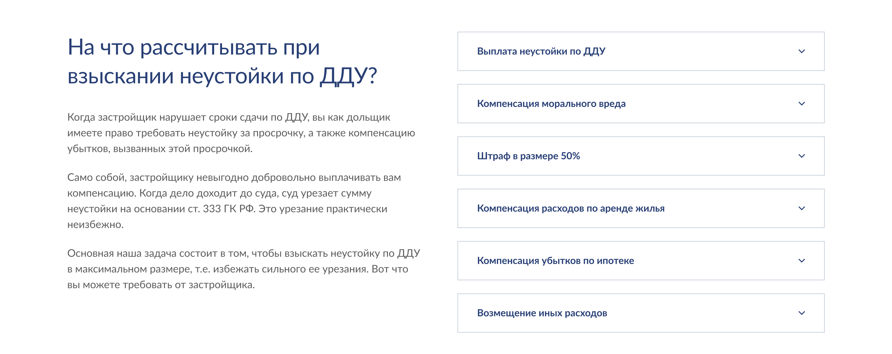
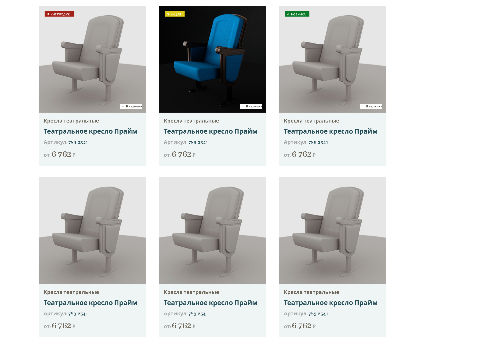
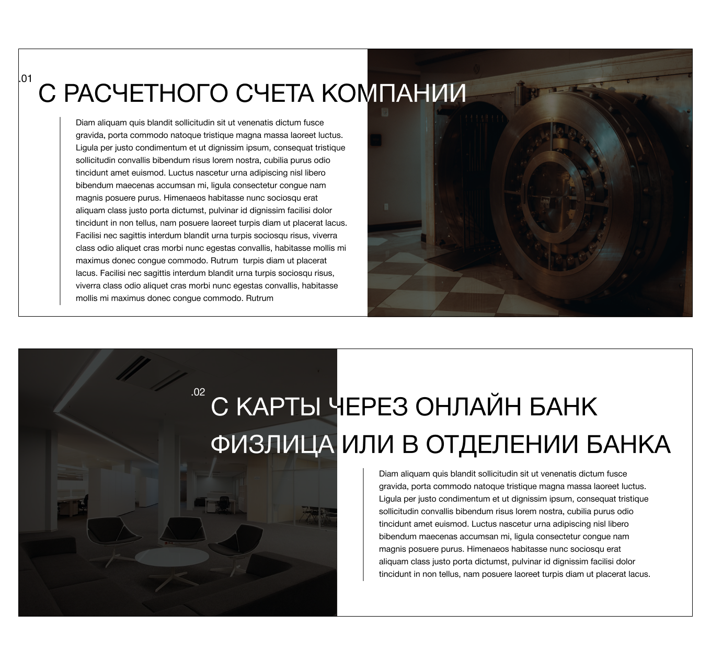
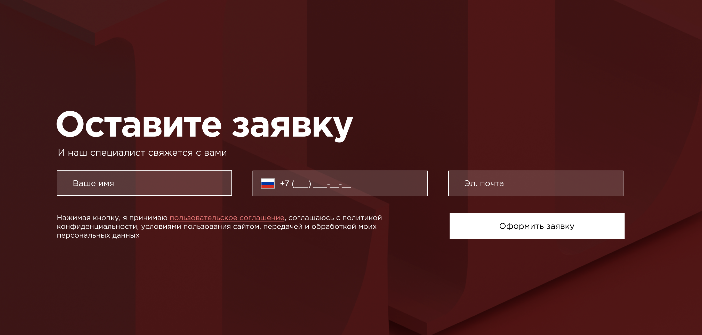
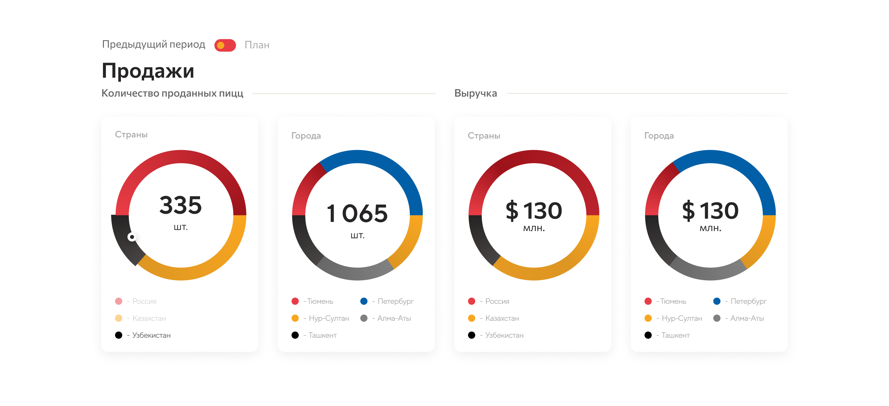

# Тестовое задание на позицию Junior Frontend-разработчик

## Case - 1
Сверстать блок с аккордеоном. Использовать чистый js без адаптива.  Текст в блоке слева будет приходить из админ панели Wordpress, заполняемый пользователем  в редакторе текста без навыков верстки.

## Case - 2
Сверстать блок с  карточками.  Должно адекватно показываться при любом количестве карточек. Без адаптива.

## Case - 3
ССверстать блок с адаптивной версией. Предусмотреть возможное добавление блоков без дополнительных манипуляций с классами. Контентная часть правится через админку WordPress.

## Case - 4
Сверстать блок с  формой. Реализовать отправку данных формы. Без адаптива.

## Case - 5
Сверстать блок с графиками используя любую js-библиотеку. 

### Что использовал:

* HTML
* SASS
* JS
* Gulp
* Webpack
* Chart.js
* Maskito

### Что можно улучшить:

* Использовать `d3.js` вместо `Chart.js` для стилизации в соответствии с макетом;
* Добавить `autoprefixer`;
* Выполнить `TODO` комментарии в коде.
